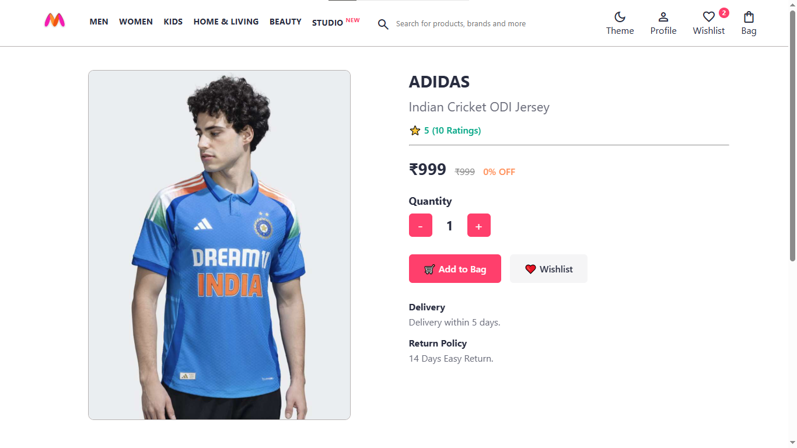
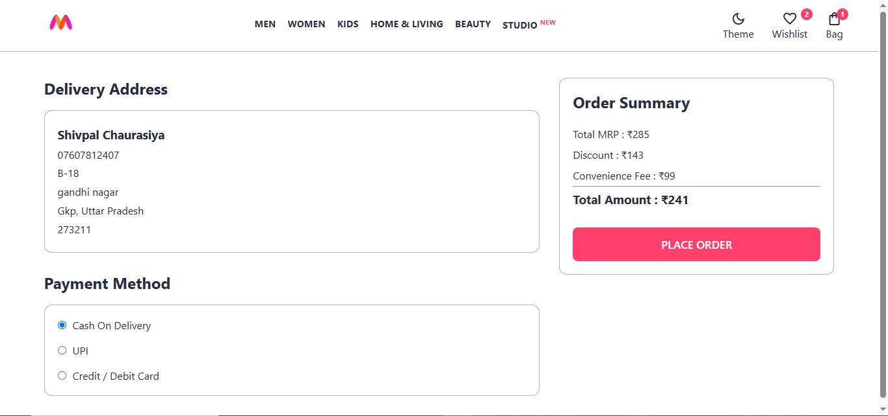
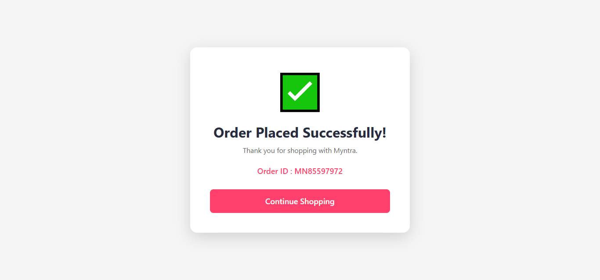
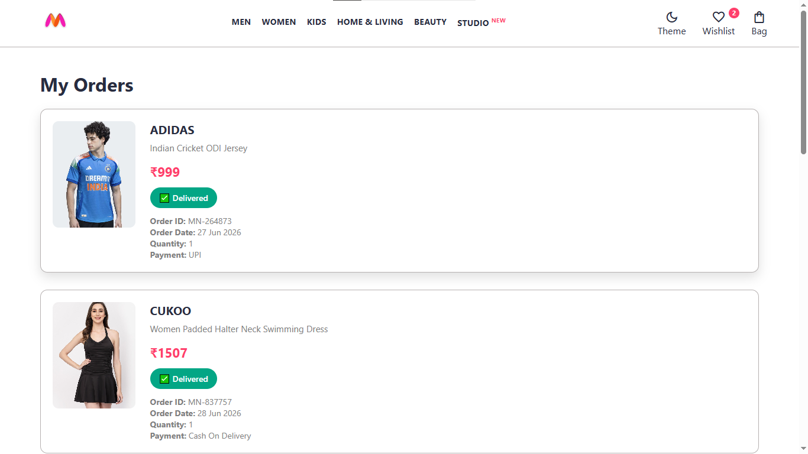
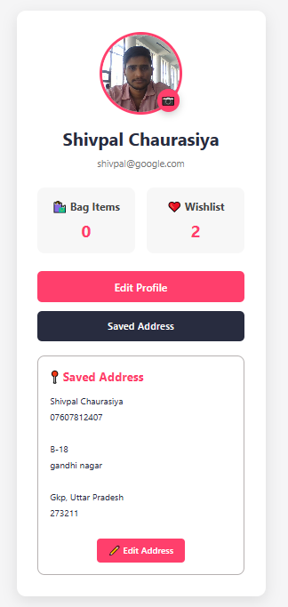
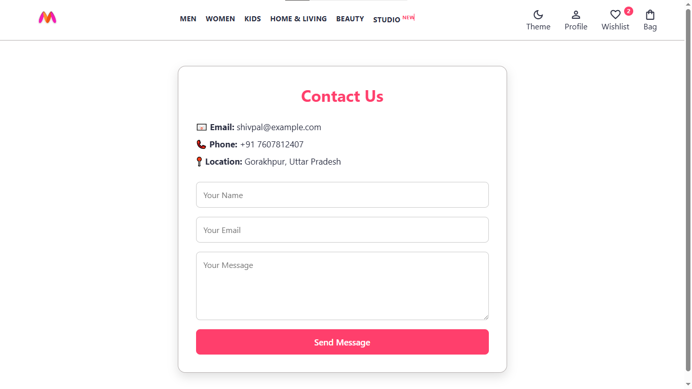

# 🛍️ Myntra Clone


A modern **Myntra-inspired E-Commerce Frontend Project** built using **HTML, CSS, and JavaScript**.


This project recreates the shopping experience of Myntra with a clean, responsive, and interactive UI. It includes shopping features such as **Wishlist, Shopping Bag, Checkout, Profile Management, Dark Mode, Product Search, Product Sorting, Toast Notifications, and Local Storage**.

## 🚀 Key Highlights

- ✅ Fully Responsive Design
- ✅ Dark / Light Theme
- ✅ LocalStorage Based
- ✅ Pure HTML, CSS & JavaScript
- ✅ Modern UI/UX
- ✅ Multi-Page E-Commerce Website

---

## 🌐 Live Demo

🔗 https://shivpal18.github.io/Myntra-Clone/

## 📂 Repository

🔗 https://github.com/shivpal18/Myntra-Clone

---

# ✨ Features

### 🛍️ Shopping
- Product Listing
- Product Search
- Product Sorting
- Product Details Page
- Product Quick View Modal
- Shopping Bag
- Quantity Increase / Decrease
- Remove Items
- Wishlist
- Move Wishlist Items to Bag

### 💳 Checkout

* Delivery Address
* Payment Method Selection
* Order Summary
* Place Order
* Order Success Page
* My Orders Page

### 👤 User Profile

* Profile Page
* Edit Profile
* Upload Profile Photo
* Saved Address
* Edit Address

### 📞 Contact
- Contact Page
- Responsive Contact Form

### 🎨 UI Features

* Dark / Light Theme
* Responsive Design
* Toast Notifications
* Profile Dropdown
* LocalStorage Support

---

# 🛠️ Tech Stack

- 🌐 HTML5
- 🎨 CSS3
- ⚡ JavaScript (ES6)
- 💾 LocalStorage API
- 🎯 Google Material Symbols

---

# 📂 Folder Structure

```text
Myntra-Clone
│
├── css
│   ├── bag.css
│   ├── checkout.css
│   ├── contact.css
│   ├── index.css
│   ├── order-success.css
│   ├── orders.css
│   ├── product.css
│   └── profile.css
│
├── data
│   └── items.js
│
├── images
│
├── pages
│   ├── bag.html
│   ├── checkout.html
│   ├── contact.html
│   ├── order-success.html
│   ├── orders.html
│   ├── product.html
│   ├── profile.html
│   └── wishlist.html
│
├── screenshots
│
├── scripts
│   ├── bag.js
│   ├── checkout.js
│   ├── common.js
│   ├── contact.js
│   ├── index.js
│   ├── order-success.js
│   ├── orders.js
│   ├── product.js
│   ├── profile.js
│   └── wishlist.js
│
├── index.html
└── README.md
```

---

# 📸 Screenshots

## 🏠 Home Page


---

## 🌙 Dark Mode


---

## 📦 Product Details



---

## ❤️ Wishlist


---

## 🛒 Shopping Bag


---

## 💳 Checkout



---

## ✅ Order Success



---

## 📋 My Orders



---

## 👤 Profile



---

## 📞 Contact



---

# 🚀 Installation

```bash
git clone https://github.com/shivpal18/Myntra-Clone.git

cd Myntra-Clone
```

Run the project using **VS Code Live Server** or simply open **index.html** in your browser.

---

# 📱 Responsive Design

This project is fully responsive and optimized for:

* 💻 Desktop
* 💻 Laptop
* 📱 Tablet
* 📱 Mobile Devices

---

# 🔮 Future Improvements

* User Login & Authentication
* Backend (Node.js / Express)
* Database Integration
* Online Payment Gateway
* Product Categories & Filters
* Product Reviews & Ratings

---

# 👨‍💻 Author

**Shivpal Chaurasiya**

GitHub: [shivpal18](https://github.com/shivpal18)

---

## ⭐ Support

If you like this project, don't forget to **Star ⭐ the repository**.

---

# 📄 License

This project is created for educational and portfolio purposes.