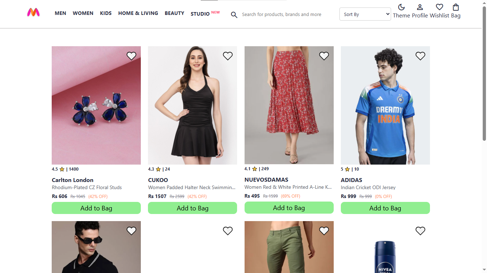
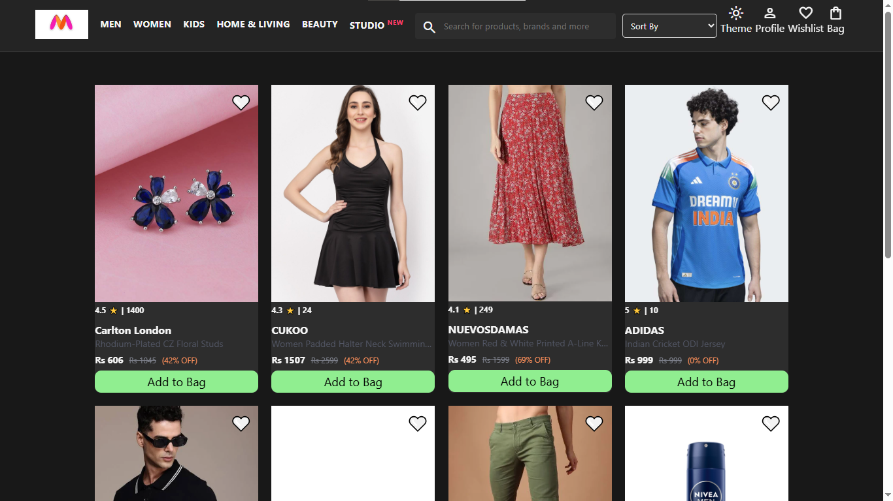
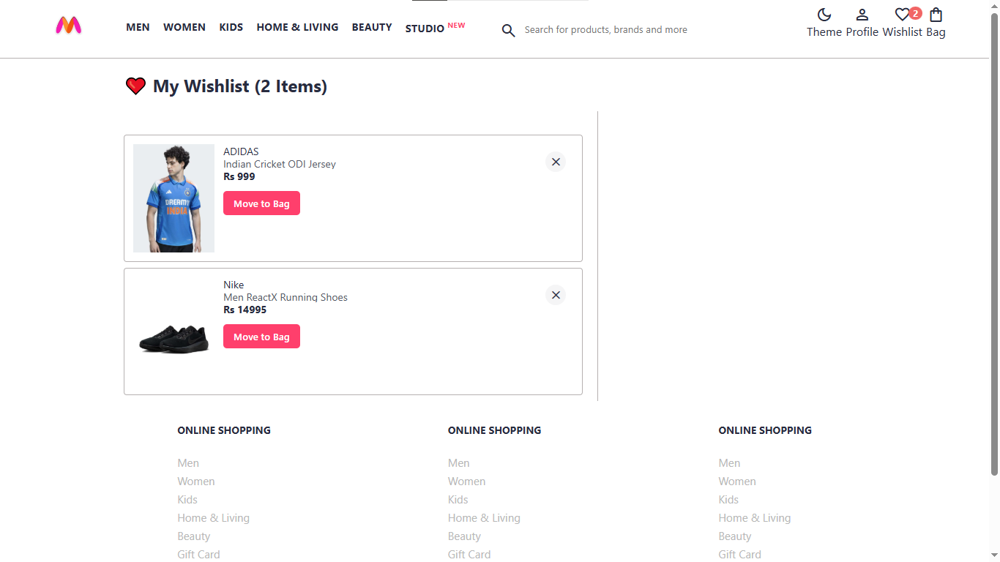
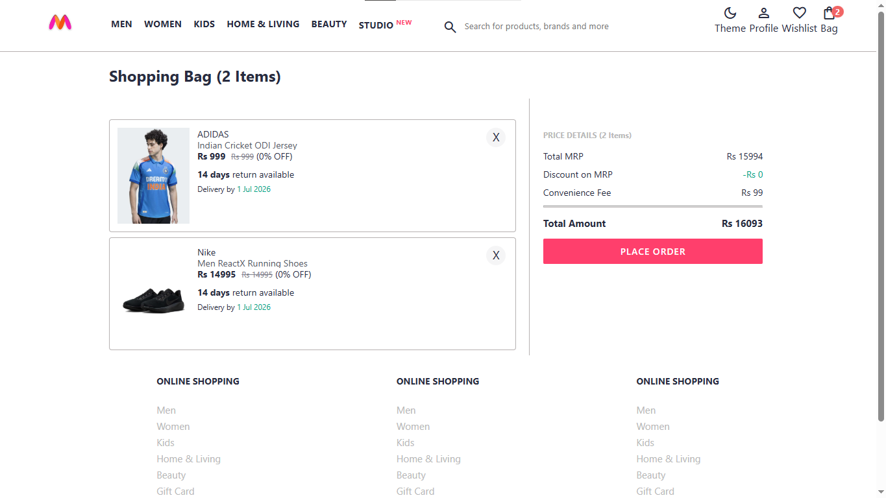

# 🛍️ Myntra Clone

A modern **Myntra-inspired E-Commerce Frontend** built using **HTML, CSS, and JavaScript**.

This project recreates the shopping experience of Myntra with a clean and responsive UI. It includes interactive features like **Dark Mode, Wishlist, Shopping Bag, Product Search, Product Sorting, Quick View Modal, Toast Notifications, and Local Storage**.

---

## 🌐 Live Demo

🔗 **Live Website:**
https://shivpal18.github.io/Myntra-Clone/

---

## 📂 GitHub Repository

🔗 **Repository:**
https://github.com/shivpal18/Myntra-Clone

---

# ✨ Features

* 🌙 Dark / Light Theme
* ❤️ Wishlist
* 🛒 Shopping Bag
* 🔄 Move Wishlist Items to Bag
* 🔍 Product Search
* 📊 Product Sorting
* 👤 Profile Dropdown
* 📦 Product Quick View Modal
* 🔔 Toast Notifications
* 💾 LocalStorage Support
* 📱 Fully Responsive Design

---

# 🛠️ Tech Stack

* HTML5
* CSS3
* JavaScript (ES6)
* LocalStorage API
* Google Material Symbols

---

# 📂 Folder Structure

```text
Myntra-Clone
│
├── css
├── data
├── images
├── pages
├── scripts
│   ├── common.js
│   ├── index.js
│   ├── bag.js
│   └── wishlist.js
│
├── index.html
└── README.md
```

---

# 📸 Screenshots

## 🏠 Home Page



---

## 🌙 Dark Mode



---

## ❤️ Wishlist



---

## 🛒 Shopping Bag



---

# 🚀 Installation

```bash
git clone https://github.com/shivpal18/Myntra-Clone.git
cd Myntra-Clone
```

Open **index.html** in your browser or run the project using **VS Code Live Server**.

---

# 🎯 Future Improvements

* User Authentication
* Order History
* Checkout Flow
* Backend Integration
* Payment Gateway
* Product Categories

---

# 👨‍💻 Author

**Shivpal Chaurasiya**

GitHub: https://github.com/shivpal18

---

## ⭐ Support

If you like this project, don't forget to **Star ⭐ the repository**.
